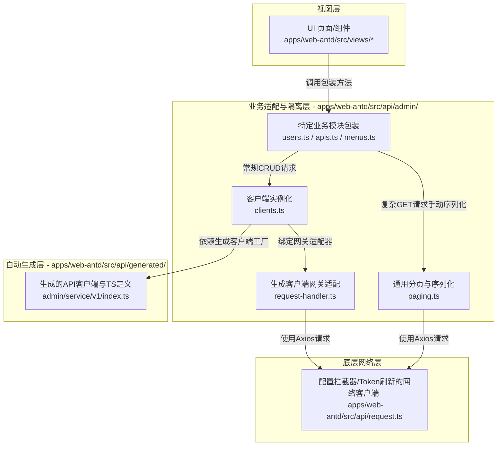

# XAdmin admin-ui API层与代码结构设计分析报告

本报告旨在分析 XAdmin 项目中前端 `admin-ui` 的代码结构与 API 层设计，为后续的重构与开发工作提供完整的上下文和决策依据。

---

## 1. 项目整体架构概述

XAdmin 前端是基于 **Vben Admin** 框架（基于 Vue 3 + Vite + TypeScript）开发的管理后台系统。项目采用了现代的前端 **Monorepo**（单体多包）架构：

- **工作空间管理 (`pnpm-workspace.yaml`)**：
  - `apps/`：包含具体的应用程序。其中 `apps/web-antd` 是使用 **Ant Design Vue** 的主要子应用。
  - `packages/`：存放共享的模块和库（如 `@core/base`, `@core/ui-kit`, `stores`, `types`, `utils` 等），实现跨应用的代码复用。
  - `internal/`：内部工具和构建配置（如 `lint-configs`）。

---

## 2. API 层架构深度分析

API 层位于子应用 `apps/web-antd/src/api` 下，整体设计分为 **自动生成层**、**底层网络层** 和 **业务适配层** 三层结构：

### 2.1 自动生成层 (`src/api/generated/admin/service/v1/index.ts`)

- **生成源**：后端基于 Protobuf 定义，使用 `protoc-gen-typescript-http` 插件生成。
- **文件特性**：大小约 230KB，包含完整的后端 API 对应的数据结构类型（TypeScript interface/type）以及客户端调用代码。
- **设计亮点——传输解耦**：生成的客户端工厂函数（例如 `createUserServiceClient`）接受一个自定义 of `RequestHandler` 回调函数。客户端只负责：
  1.  拼接请求路径（Path）
  2.  指定 HTTP 方法（Method）
  3.  序列化请求体（Body）
  4.  传递方法元数据（Service/Method 名字）

  具体的网络请求发送、Headers 配置、响应解包等职责完全解耦，交给传入的 Handler 来处理。

### 2.3 底层网络层 (`src/api/request.ts`)

- **实现基础**：基于 Vben 提供的 `@vben/request`（对 Axios 的一层封装）创建了 `requestClient`。
- **统一职责**：
  - **基础路径配置**：根据环境变量 `import.meta.env` 自动获取后台服务的 `apiURL`。
  - **鉴权与请求头**：自动从 `useAccessStore` 获取最新的 `accessToken`，并在请求头中注入 `Authorization: Bearer <token>` 和 `Accept-Language`。
  - **Token 无感知刷新**：注入响应拦截器，在发现 Token 过期时调用 `refreshTokenApi` 刷新，成功后重试原请求；若刷新失败或无效则强制触发重新登录流程。
  - **全局错误拦截**：提供了 `resolveErrorMessage` 函数，解析后端返回的 `reason`（如 `TOKEN_EXPIRED`, `UNAUTHORIZED` 等）或具体错误文本，自动翻译并使用 Ant Design 的 `message.error` 进行气泡提示。

### 2.3 业务适配层 (`src/api/admin/`)

为了规避生成代码的局限性并提供更加友好的 API，项目在生成代码之上建立了一层手写的适配层：

#### ① `clients.ts`

负责将 `generated` 目录中导出的客户端工厂函数统一绑定 `adminRequestHandler` 并实例化导出为单例客户端（如 `apiClient`, `userClient`, `menuClient` 等）。

#### ② `request-handler.ts`

实现了生成代码所需的 `RequestHandler`。主要负责：

- 反序列化请求体（由于生成客户端默认将 Body 序列化为 JSON 字符串，Handler 在发送请求前将其还原为对象）。
- 调用网络层的 `requestClient` 发送请求。
- **解包通用响应体**：后端通常返回形如 `{ code: number, data: any, message: string }` 的信封对象（Response Envelope）。Handler 会校验 `code === 0`，若正常则剔除信封直接返回 `data`，否则抛出 JS 异常。

#### ③ `paging.ts` —— 关键规避逻辑点 ⚠️

- **代码生成缺陷**：GET 请求携带复杂嵌套过滤条件（如 `filterExpr.conditions` 数组、`sorting` 数组）时，`protoc-gen-typescript-http` 自动生成的序列化逻辑存在缺陷。它生成了类似 `request.filterExpr?.conditions?.field` 的代码，**错误地将数组字段当成了单对象处理**，导致多个过滤条件及排序规则在转换为 Query 字符串时丢失或格式错误。
- **解决方案**：适配层没有直接使用生成的 `List` 客户端方法。而是由 `paging.ts` 实现了手动的 Query 序列化逻辑（通过 `buildPagingQuery` 和 `appendFilterExpr`），并导出了 `getAdminList` 方法。例如在查询用户列表 `listAdminUsersApi` 时，它会调用 `getAdminList('/admin/v1/users', toPagingRequest(params))`，通过拼接正确的 URL 参数（如 `filterExpr.conditions.field=username&filterExpr.conditions.op=CONTAINS...`）发送请求。

#### ④ 特定业务模块（如 `users.ts`, `menus.ts`, `apis.ts` 等）

为 UI 组件提供高度定制和友好的接口：

- **类型重定义**：将生成的冗长类型重定义为简短的本地命名（如 `export type AdminUser = identityservicev1_User`）。
- **数据清洗（Sanitization）**：在发送给后端前清理数据空格（如 `cleanText`），保证入参干净。
- **局部更新掩码构造（UpdateMask）**：后端使用 Google AIP-134 规范的局部更新模式。在调用更新接口时，适配层会显式传入需要更新的字段名列表（`updateMask`，逗号分隔的字符串，例如 `'username,nickname,gender'`），避免未修改的字段在后端被误覆盖。
- **业务逻辑封装**：如 `menus.ts` 中封装了 `buildMenuTree`，将后端返回的扁平菜单数组在前端实时转换成 UI 渲染所需的树形结构。

---

## 3. 视图层与 API 层的交互模式

在 `admin-ui` 中，视图组件（如 `apps/web-antd/src/views/system/user/index.vue`）的交互遵循以下规范：

1.  **绝不直接导入 `generated` 目录下的代码**。
2.  **只从 `src/api/admin/*` 或 `src/api/core/*` 导入包装好的 API 函数**。
3.  通过这种设计，即使后端接口结构变化，或者自动生成工具替换，也只需要修改适配层的模块文件，视图层可以做到几乎零改动，大幅提升了系统的可维护性与重构效率。

---

## 4. 后续重构与开发建议（Context）

在未来的重构或新功能开发中，应严格遵循并维护当前的设计架构，注意以下几点：

### 4.1 需要坚守的原则

- **保持适配隔离层**：所有对 API 的调用必须经过适配层。新增模块（如 `dict.ts` 等）时，应继续在 `api/admin/` 下建立对应的包装文件。
- **利用 `updateMask` 进行局部更新**：在更新数据（PUT 行为）时，必须明确构建并传递 `updateMask` 列表，防止后端全量覆盖产生安全或业务隐患。
- **继续采用 `paging.ts` 处理分页**：对于所有涉及复杂列表筛选 and 排序的 GET 请求，统一使用 `toPagingRequest` 构建条件并使用 `getAdminList` 发送。

### 4.2 优化空间

- **冗余转换的提炼**：目前各个模块文件（如 `users.ts`, `apis.ts`, `menus.ts`）中存在大量重复的 `cleanText` 函数和属性的手动映射转换。后续可以将这部分逻辑提炼为通用的数据转换工具函数。
- **生成器演进**：未来若升级或更换 Protobuf 生成工具（例如支持标准 AIP 查询参数序列化的生成器），可逐步废除 `getAdminList` 手动序列化，恢复直接调用生成的 `List` 接口，以减少手写代码。
- **统一自定义操作路由规范**：类似 `menus:sync` 这种无法被 CRUD 生成器覆盖的自定义 Action 接口，目前是通过 Axios 裸调用。建议在适配层中为此类特殊操作建立一致的命名规范（例如命名为 `xxxActionApi`），以便于统一管理。
